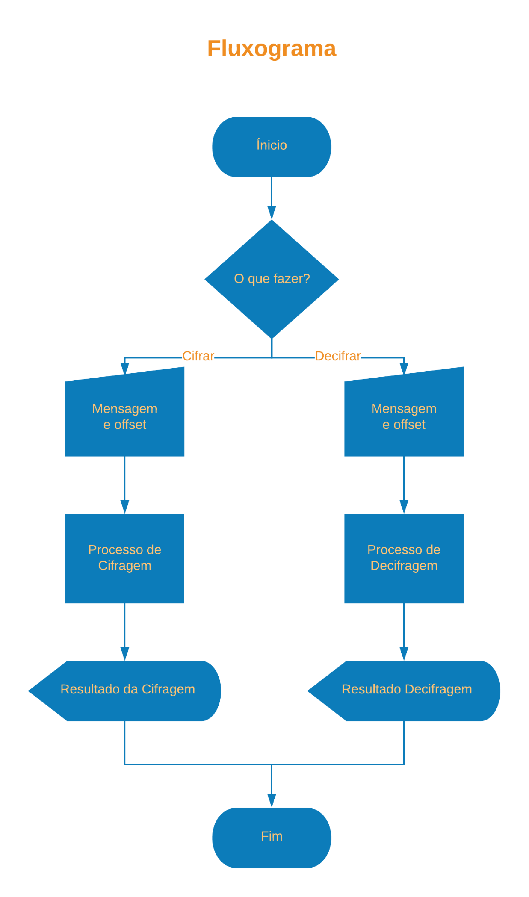
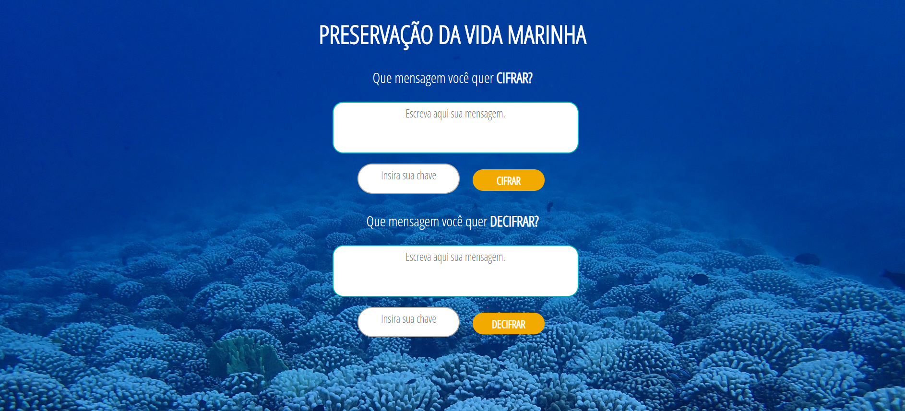

# Cifra de César

## Índice

* [1. Como a Cifra de Cesar Funciona?](#1-como-a-cifra-de-cesar-funciona?)
* [2. O Usuário](#2-o-usuário)
* [3. O Projeto](#3-o-projeto)
* [4. Interface](#4-a-interface)
* [5. Objetivos de aprendizagem](#5-objetivos-de-aprendizagem)
* [6. Checklist](#6-checklist)
***

## 1. Como a Cifra de Cesar Funciona?

Cifrar significa codificar. A [cifra de
César](https://pt.wikipedia.org/wiki/Cifra_de_C%C3%A9sar) é um dos primeiros
tipos de criptografias conhecidas na história. 
A cifra de César é uma das técnicas mais simples de cifrar uma mensagem. É um
tipo de cifra por substituição, em que cada letra do texto original é
substituida por outra que se encontra há um número fixo de posições
(deslocamento) mais a frente do mesmo alfabeto.

## 2. O Usuário

Cada dia mais a preocupação com o meio-ambiente aumenta e o ecossistema marinho é importante para sobrevivência da humanidade na Terra. Os oceanos produzem metade do nosso oxigênio, reduzem as condições climáticas, absorvem grande quantidade de gás carbônico e fornecem alimentos a milhões de pessoas.

Mas não é só a poluição e contaminação que influenciam negativamente nesse ecossistema, a pesca sem controle, o turismo desordenado, casas e hoteis sendo construidos em lugares irregulares, tudo resultado de uma educação ambiental defasada, também são prejudiciais.

Para essa preservação acontecer existem organizações não governamentais que estão dispostas a realizar esse trabalho. Como muitas vezes essas ONGs lutam contra governos e empresas poderosas elas necessitam um canal seguro para se comunicar, essa criação foi criada para esse fim.

## 3. O Projeto

A aplicação permite cifrar e decifrar letras maíusculas, minusculas, símbolos, espaços a partir do texto e do offset, positivo ou negativo, inserido pelo usuário.

## 4. A Interface

O usuário pode escolher entre cifrar ou decifrar uma mensagem, inserir a mensagem que será cifrada/decifrada, inserir o offset ou chave de deslocamento e receber a mensagem cifrada/decifrada

## 5. Objetivos de aprendizagem

Construir uma aplicação web que interaja com o usuário através do navegador e a lógica para essa interação com **HMTL, CSS e JavaScript**.

## 6. Checklist

Essa seção é para te ajudar a ter um controle do que você precisa completar.

### Parte Obrigatória

* [✔] `README.md` adicionar informação sobre o processo e decisões do desenho.
* [✔] `README.md` explicar claramente quem são os usuários e as suas relações
  com o produto.
* [✔] `README.md` explicar claramente como o produto soluciona os
  problemas/necessidades dos usuários.
* [✔] Usar VanillaJS.
* [✔] **Não** usar `this`.
* [✔] Implementar `cipher.encode`.
* [✔] Implementar `cipher.decode`.
* [✔] Passar o linter com a configuração definida.
* [✔] Passar as provas unitárias.
* [✔] Testes unitários cubrindo 70% dos _statements_, _functions_ e _lines_, e
  no mínimo 50% das _branches_.

### Parte Opcional: "Hacker edition"

* [✔] Cifrar/decifrar minúsculas.
* [✔] Cifrar/decifrar _outros_ caractéres (espações, pontuação, `ç`, `á`, ...).
* [✔] Permitir usar `offset` negativo.  